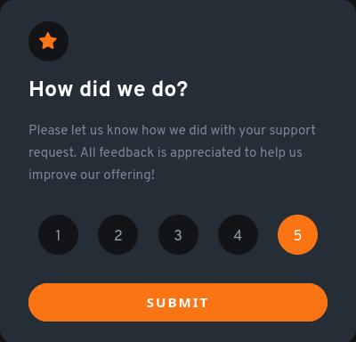

# Frontend Mentor - Interactive rating component


## Welcome! 👋

Thanks for checking out this front-end coding challenge.

[Frontend Mentor](https://www.frontendmentor.io) challenges help you improve your coding skills by building realistic projects.

**To do this challenge, you need a basic understanding of HTML, CSS and JavaScript.**

## Table of contents

- [Overview](#overview)
  - [Screenshot](#screenshot)
  - [Links](#links)
- [My process](#my-process)
  - [Built with](#built-with)
  - [What I learned](#what-i-learned)
  - [Continued development](#continued-development)
  - [Useful resources](#useful-resources)
- [Author](#author)
- [Acknowledgments](#acknowledgments)


## Overview

### Screenshot




### Links

- Solution URL: [Source Code](https://github.com/AlexdelCarmen/interactive-rating)
- Live Site URL: [Live Page](https://alexdelcarmen.github.io/interactive-rating/)

## My process

Started off by creating the HTMl structure and applying all styles for both cards, next I applied vanilla JavaScript to make the rating interactive, finally some tweaks via media query to ensure responsiveness. 

### Built with

- Semantic HTML5 markup
- CSS custom properties
- Flexbox
- Mobile-first workflow
- Vanilla JavaScript

### What I learned

forEach, I have seen the function here and there on a couple of tutorials, but had to apply it on my own here to get event listeners applied to all the 5 rating buttons. 

To see how you can add code snippets, see below:

```js
ratings.forEach((rating) =>
  rating.addEventListener("click", (e) => {
    ratings.forEach((rating) => rating.classList.remove("rate-selected"));
    e.target.classList.toggle("rate-selected");
  })
);

```

### Continued development

I was still not able to gauge colors perfectly this time around, but getting better on sizes, my usage of the classList.toggle needs to improve too. 

### Useful resources

- [W3Schools](https://www.w3schools.com/) - I used W3Schools to check on how to use forEach. 

## Author

- Website - [Github Profile](https://github.com/AlexdelCarmen)
- Frontend Mentor - [@AlexdelCarmen](https://www.frontendmentor.io/profile/AlexdelCarmen)
- Twitter - [@AlekBorchov](https://twitter.com/AlekBorchov)

## Acknowledgments

To my kids, those two little ninjas are the reason I do all of this. 
